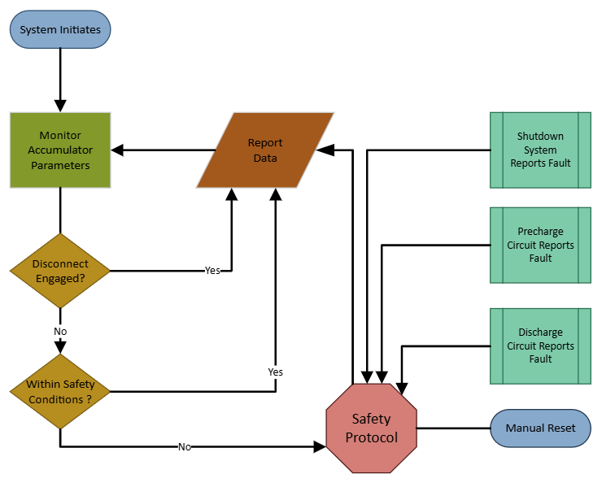

# 
 Formula SAE Electric Vehicle: Battery Management System
## 
  Detailed Design

 M. Miranda, mmirandam42@tntech.edu  

 Electrical and Computer Engineering Department  

 Tennessee Technological University  

   
## Function of the Subsystem

The Battery Management System (BMS), also referred to as the Accumulator Management System (AMS), functions as an intermediary communicator between the accumulator and the rest of the vehicle’s electrical system. It serves as the supervisory component responsible for monitoring the accumulator’s key parameters, including cell voltage, temperature, and overall system integrity. It continuously verifies that all monitored values remain within the safe operating limits defined by SAE regulations. If a fault is detected—such as an overvoltage condition or a temperature anomaly—the BMS is responsible for disconnecting the accumulator from the rest of the vehicle. This subsystem is essential not only for intra-system communication and regulatory compliance, but also for protecting the vehicle, its occupants, and surrounding infrastructure.

## Specifications and Constraints

### Specifications

The Battery Management System shall continuously monitor the voltage, temperature, and overall status of the accumulator to ensure safe and reliable operation under all vehicle conditions. It shall function during both charging and active operation of the Tractive System.

The BMS shall promptly detect faults such as out-of-range voltage or temperature, loss of sensor signals, or internal malfunctions. In the event of a fault, the BMS shall trigger shutdown protocol by disabling the vehicle’s high-voltage circuit and activating a red “BMS” indicator light, clearly visible to the seated driver, in compliance with SAE regulations.

The design aims to meet all relevant SAE constraints while ensuring system performance supports consistent speeds up to 55 mph (80.4 kph) in runs of up to 13.6 miles (22 km). These objectives are to be achieved while upholding high safety and reliability standards throughout operation.

### Constraints

Per Formula SAE regulations:

   #### Shutdown Circuit EV.7.1 [1]

   - The BMS, IMD, and BSPD parts of the Shutdown Circuit must be Normally Open EV.7.1.3 [1]
  
   - The BMS, IMD and BSPD must have completely independent circuits to Open the Shutdown
Circuit. EV.7.1.4 [1]

   #### Battery Management System - BMS EV.7.3 [1]
   
   - The Battery Management System shall monitor the Accumulator(s) Voltage EV.7.4 and Temperature EV.7.5 when the EV.7.3.1:  [1]

      - Tractive System is Active EV.11.5  [1]

      - Accumulator is connected to a Charger EV.8.3  [1]

   - The BMS shall have galvanic isolation at each segment to segment boundary, as approved in the ESF EV.7.3.2 [1]

   - Cell balancing is not permitted when the Shutdown Circuit is Open ( EV.7.2, EV.8.4 )  EV.7.3.3 [1]
   
   - The BMS shall monitor for EV.7.3.4: [1]

      - Voltage values outside the allowable range EV.7.4.2 [1]

      - Voltage sense Overcurrent Protection device(s) blown or tripped [1]

      - Temperature values outside the allowable range EV.7.5.2 [1]

      - Missing or interrupted voltage or temperature measurements [1]

      - A fault in the BMS [1]

   - If the BMS detects one or more of the conditions of EV.7.3.4 above, the BMS shall EV.7.3.5 : [1]

      - Open the Shutdown Circuit EV.7.2.2 [1]

      - Turn on the BMS Indicator Light and the Tractive System Status Indicator EV.5.11.5 The two lights shall stay on 
        until the BMS is manually reset EV.7.2.3 [1]

   - The BMS Indicator Light shall be EV.7.3.6: [1]

      - Color: Red [1]

      - Clearly visible to the seated driver in bright sunlight [1]

      - Clearly marked with the lettering “BMS” [1]
 
   #### Accumulator Voltage EV.7.4  [1]

   - The BMS shall measure the cell voltage of each cell When single cells are directly connected in parallel, only one voltage measurement is needed EV.7.4.1 [1]

   - Cell Voltage levels shall stay inside the allowed minimum and maximum cell voltage levels stated in the cell data sheet. Measurement accuracy shall be considered. EV.7.4.2 [1]
   
   - All voltage sense wires to the BMS shall meet one of EV.7.4.3:  [1]

      - Have Overcurrent Protection EV.7.4.4 below  [1]

      - Meet requirements for no Overcurrent Protection listed in EV.7.4.5 below  [1]

   - When used, Overcurrent Protection for the BMS voltage sense wires shall meet the two EV.7.4.4:  [1]

      - The Overcurrent Protection shall occur in the conductor, wire or PCB trace which is directly connected to the cell tab.  [1]

      - The voltage rating of the Overcurrent Protection shall be equal to or higher than the maximum segment voltage  [1]

   - Overcurrent Protection is not required on a voltage sense wire if all three conditions are met EV.7.4.5:  [1]

      - BMS is a distributed BMS system (one cell measurement per board) [1]

      - Sense wire length is less than 25 mm  [1]

      - BMS board has Overcurrent Protection [1]

   #### Accumulator Temperature EV.7.5 [1]

   - The BMS shall measure the temperatures of critical points of the Accumulator EV.7.5.1 [1]

   - Temperatures (considering measurement accuracy) shall stay below the lower of the two EV.7.5.2:  [1]

      - The maximum cell temperature limit stated in the cell data sheet  [1]

      - 60°C [1]

   - For lithium based cells, EV.7.5.5:  [1]

      - The temperature of a minimum of 20% of the cells shall be monitored by the BMS  [1]

      - The monitored cells shall be equally distributed inside the Accumulator Container(s), the temperature of each cell should be monitored [1]
     
   #### Charging Shutdown Circuit EV.8.3 [1]

   - The BMS and IMD parts of the Charging Shutdown Circuit must, EV.8.3.2: [1]

     - Be designed as Normally Open contacts [1]
    
     - Have completely independent circuits to Open the Charging Shutdown Circuit [1]
 
     - Design of the respective circuits must make sure that a failure cannot result in electrical
power being fed back into the Charging Shutdown Circuit. [1]

   #### Charging Shutdown Circuit Operation EV.8.4 [1]

   - When Charging, the BMS and IMD must, EV.8.4.1: [1]

      - Monitor the Accumulator [1]
     
      - Open the Charging Shutdown Circuit if a fault is detected [1]

   #### Other

   - The Battery Management System shall prevent the maximum current drawn from accumulator T.9.2.2 [1]
  
     
## Overview of Proposed Solution

Considering the specifications and constraints of the BMS subsystem, Orion 2 BMS is well suited as a battery monitoring and managing solution.

The Orion 2 BMS is able to manage all critical functions of the 30s14p battery pack, including real-time monitoring of all cells voltage, temperature, and fault detection. It supports up to 180V nominal system voltage and offers passive balancing to maintain cell voltage uniformity, which is essential for preserving battery health and energy efficiency.

The Orion 2 BMS also fulfills the communication and integration requirements of this subsystem through its support for industry-standard protocol, CANbus, enabling seamless interfacing with the motor controller. Furthermore, its advanced diagnostics and configuration software provide intuitive tools for monitoring and managing the entire accumulator system.

In addition, Orion’s expandability and configurability allow it to be tailored precisely to the battery architecture and application constraints, including high-current handling, voltage protection thresholds, and operational temperature ranges.The Orion 2 BMS is a robust, automotive-grade solution engineered for high-reliability applications, making it an ideal fit for the project’s safety and communication requirements.

## Interface with Other Subsystems

### Accumulator

Inputs to BMS: Continuous real-time data from the battery cells in the form of voltage, temperature, and current readings via sensor lines. Analog signals transmitted through hardwired connections.  
Outputs from BMS: Indirectly commands system disconnect via isolation relay, digital signal.  

### Precharge Circuit

Inputs to BMS: Ready to precharge, completed precharge, and fault status. Digital signals.  
Outputs from BMS: Status request, precharge start and end command. Digital signals.  

### Discharge Circuit

Inputs to BMS: Discharge and fault status. Digital signals.  
Outputs from BMS: Discharge permited and prohibited instruction via digital signals.  

### Accumulator Container

Inputs to BMS: No active data or signals are transmitted from the the container to the BMS. However, the enclousure includes a manual reset interface accessible to the user, enabling manual system restart after a fault condition.   
Output from BMS: No active data or signals are transmitted from the BMS to the container itself.  

### Controller and Shutdown System

Inputs to BMS: Status of shutdown system via CAN communication, digital signal. If any part of the shutdown system in fault status, the BMS commands disconnect until fault is corrected.   
Output from BMS: CAN communication, digital signals. Continuous accumulator system status report.  

## Buildable Schematic 

From Capstone Fall 2024-Spring 2025 Team

## Flowchart

 

## Bill of Materials

Provide a comprehensive list of all necessary components along with their prices and the total cost of the subsystem. 
If the component is included in your schematic diagram, ensure inclusion of the component name on the BOM (i.e R1, C45, U4).

| Item | Manufacturer | Part Number | Distributor | Distributor Part Number | Quantity | Price (USD) | Purchasing Website URL | 
|  :---:   |  :---:  |  :---:   |  :---:   |  :---:   |  :---:   |  :---:   |  :---:   |
| |  |  | |  | | | |
|  Orion 2 BMS |  Ewert Energy Systems, Inc |  Orion O2 Battery Management System | Evolve Electronics |  Orion O2 Battery Management System 36 200A |  1 |  1,295 |  [site](https://evolveelectrics.com/products/orion-bms-2?variant=41792470351970) |
|  Crimping Tool |  |  | |  |  | 0.00 | |
|  Wire Strippers |  |  | |  |  | 0.00 | |
| |  |  | |  | | | |
|  Total $  |  |  | |  |  | 1,295.00 | |

## Analysis of Design Decisions

The options available for this subsystem were designing a BMS from scratch, using a TinyBMS (a compatible BMS sold with Molicels), and using a Orion 2 BMS. Due to time limitations and  because there are readily available compatible BMS on the market, it would be impractical to build a BMS from scratch. The TinyBMS was promising due to its compatability with the Molicels and because it met many of the subsytem needs such as CAN communication, temperature, and current readings. However, the TinyBMS could only support 75V nominal system voltage and is not stackable [4]. Additionally, due to contraints requiring 20% of all cells to be monitored and the requirement that the monitored cells must be equally distributed inside the Accumulator Container [1], with a battery pack with configuration of 30s14p four TinyBMS must have been purchased totaling $1,558 not including shipping.  

The Orion BMS 2 is designed for centralized, large-scale battery monitoring, with support for up to 180V systems and seamless handling of high series cell counts within a single unit. This centralized approach not only simplifies wiring and integration but drastically reduces complexity, potential points of failure, and software configuration challenges.

Moreover, the Orion BMS supports advanced features such as stackable expansion, configurable CAN communication, custom fault thresholds, and robust diagnostic tools. The Orion platform is also automotive-grade, with proven performance in EVs, energy storage systems, and industrial applications—providing high confidence in long-term reliability and safety.

In summary, although the Orion BMS has a higher unit cost, its greater scalability, system simplicity, integration support, and long-term value make it the superior design choice for this subsystem.

## References

[1] 2025 Formula SAE Rules V.1 [Regulations Manual](https://www.fsaeonline.com/cdsweb/app/NewsItem.aspx?NewsItemID=379e4a8a-80a2-4a74-87c2-6f2de4212270) (Accessed 5/5/2025)

[2] Li-ion building block with Molicel P42A [Datasheet](https://enepaq.com/wp-content/uploads/2025/02/Molicel-P42A-21700-Li-ion-Battery-Module-With-Temperature-Sensor-Datasheet-.pdf)

[3] Tiny BMS s516 – 30A / 150A / 750A [User Manual](https://enepaq.com/wp-content/uploads/2025/02/USER-MANUAL-%E2%80%93-Battery-Management-System-BMS-for-Tiny-BMS-Enepaq-.pdf)

[4] Tiny BMS s516 – 30A / 150A / 750A [Datasheet](https://enepaq.com/wp-content/uploads/2025/02/DATASHEET-%E2%80%93-Battery-Management-System-BMS-for-Tiny-BMS-Enepaq-.pdf)

[5] Orion 2 BMS [Wiring & Installation Manual](https://cdn.shopify.com/s/files/1/1820/0269/files/orionbms2_wiring_and_installation_manual.pdf?1289632542684048831)

[6] Orion 2 BMS [Specifications](https://www.orionbms.com/downloads/documents/orionbms2_specifications.pdf)

[7] Orion 2 BMS [Technical Outline](https://www.orionbms.com/downloads/drawings/orionbms2_mechanical_72.pdf)

[8] Orion 2 BMS [Quick Start Guide](https://www.orionbms.com/downloads/documents/quickstart_orion2.pdf)

[9] Orion 2 BMS [Operation Manual](https://www.orionbms.com/manuals/pdf/orionbms2_operational_manual.pdf)
