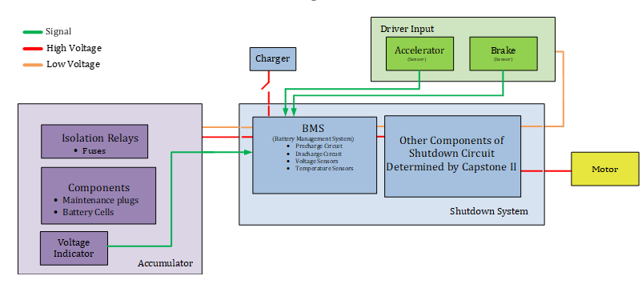

<h1>Conceptual Design: Battery Management System  

Formula SAE Electric Car Team</h1> 

<h3>Team 2: Maddox Cagle, Dylan Caten, Jordan Davis, Marisol Miranda, Mackenzie Raleigh </h3>

 

 

 

<h2>Introduction:  </h2>

The development of a custom Battery Management System (BMS) for the Formula SAE Electric Car is a crucial step toward ensuring optimal battery performance, safety, and longevity. The primary goal of this project is to create a BMS that monitors battery state, prevents hazardous failures, complies with Formula SAE safety regulations and passes the tests necessary. This document outlines the conceptional design, including the original problem formulation, solution decompositions, specifications, constraints, and an implementation roadmap for the custom BMS.  

 

<h2>Restating the Fully Formulated Problem:  </h2>

A well-designed BMS is essential for preventing battery fire in environments. The system must regulate charge levels, monitor temperature, provide cell balancing, and shut down under unsafe conditions. The formulated problem includes the following “shall” statements: 

* The BMS shall monitor the battery’s state of charge and state of health in real-time. 

* The system shall prevent overcharging, excessive discharge, and overheating. 

* The BMS shall include an automatic shutdown mechanism to reduce safety risks under the following conditions, 
  temperatures bellow -4 degrees Fahrenheit, temperatures at or above 140 degrees Fahrenheit, low charge, excessive 
  discharging, and when overcharging. 

* The system shall integrate with the car’s existing electrical architecture and Formula SAE regulations as listed in the specifications of atomic subsystems. 

* The total project cost shall not exceed $10,000, ensuring cost-effectiveness. 

<h3>Constraints and Their Origins </h3>

The design of the BMS must adhere to several constraints imposed by competition rules, engineering standards, and fire safety concerns. These include: 

* Safety Regulations: The BMS must comply with Formula SAE safety standards, including fire prevention and automatic 
  shutdown in hazardous conditions as stated above. 

* Material Constraints: The battery must be enclosed in non-flammable housing to meet industry and competition safety 
  guidelines. 

* Economic Feasibility: The total cost must remain under budget to ensure financial viability and to score well in the 
  cooresponding Formula SAE test.  

* Technical Compatibility: The BMS must be compatible with the vehicle’s electrical system which is currently being 
  designed for the Zero Motor's battery, ensuring seamless integration. 

<h2>Comparative Analysis of Potential Solutions </h2>
The formula sae event has many regulations regarding the battery and battery management system and while they do constrain options for they also help guide system design. Additionally, the battery and battery management system under design must mimick the Zero Motor's battery so that it may be used on the current vehicle.
<h3> Battery(Accumulator)</h3>

<h4> Battery Segments</h4>
The mass of a given segment may not exceed 12 kg. [2]
Each segment must use maintenance plugs to connect to other segments of the battery. [2]
Each segment must be electrically and physically issolated from eachother. [2]
The isolation relay must be used and a minimum of one fuse, to seperate the two poles of the accumulator.[2]
<h5> Battery Cells </h5>
In order to obtain similar electrical charectoristics to the Zero Motor's battery we will need to use lithium ion cells in the battery. Zero motors uses a lithium nickel manganese cobalt (LiNiMnCoO2) which is produced by Farasis.[1] Lithium cobalt has a higher energy density at the cost of battery life and reusability but is not available for commercial purchase.[1]

<h5> Comparison of Cells:</h5>
<h6> Cylindrical lithium ion: </h6>
Samsung cells: From the Samsung supplier there are a variety of battery options: [4]

* Molicel model number INR-21700-P45B

  - cycle life: reaches 80% power output at 300 cycles

  - nominal capacity: 4500 mAh

  - approximate weight:  70 g

  - country of origin: Tiawan

  - nominal voltage: 3.6 V

  - maximum voltage: 4.2 V

  - price per unit: $7.99

  - diameter: 21.55 mm

  - length: 70.15 mm

  - series connections: 28

  - parallel connections: 50

  - total units required: 1,400

  - total cost of cells: $11,186

  - total weight: 216 pounds

* Samsung SDI model number 40T (INR21700-40T)

  - cycle life: ~ 250

  - nominal capacity: 4000 mAh

  - approximate weight:  66.8 g

  - country of origin: unlisted

  - nominal voltage: 3.6 V

  - maximum voltage: 4.2 V

  - price per unit: $7.99

  - diameter: 21.1 mm

  - length: 70.4 mm

  - series connections: 28

  - parallel connections: 56

  - total units required: 1568

  - total cost of cells: $12,528.32

  - total weight: 232 pounds

* Samsung SDI model number 50T (INR21700-40T)

  - cycle life: ~ 250 to 60% capacity

  - nominal capacity: 5000 mAh

  - approximate weight:  70 g

  - country of origin: unlisted

  - nominal voltage: 3.6 V

  - maximum voltage: 4.2 V

  - price per unit: $8.99

  - diameter: 21.1 mm

  - length: 70.7 mm

  - series connections: 28

  - parallel connections: 45

  - total units required: 1260

  - total cost of cells: $11,327.40

  - total weight: 195 pounds

<h6>Ultra thin lithium ion:</h6>

* GMBPOW model number CP142828 

  - cycle life: unlisted. discharges at 2% per year at 30 degrees celcius.

  - nominal capacity: 100 mAh

  - approximate weight:  1.5 g

  - country of origin: China

  - nominal voltage: 3 V

  - maximum voltage: unlisted

  - price per unit: $5.00

  - Max. dimensions (mm) 1.6×28.5×29 

  - series connections: 34

  - parallel connections: 1853

  - total units required: 63,002

  - total cost of cells: $315,010.00

  - total weight: 208 pounds

* Huizhou Markyn New Energy Co., LTD. model number CP203030

  - cycle life: unlisted. Has a shelf life of 8 yrs.

  - nominal capacity: 230 mAh

  - approximate weight:  3 g

  - country of origin: China

  - nominal voltage: 3 V

  - maximum voltage: unlisted

  - price per unit: $5.00

  - Max. dimensions (mm) 2.1×30.0×30.0 

  - series connections: 34

  - parallel connections: 806

  - total units required: 27,404

  - total cost of cells: $137,020.00

  - total weight: 181 pounds]

* Huizhou Markyn New Energy Co., LTD. model number CP203345

  - cycle life: unlisted. Has a shelf life of 5 yrs.

  - nominal capacity: 450 mAh

  - approximate weight:  5 g

  - country of origin: China

  - nominal voltage: 3 V

  - maximum voltage: unlisted

  - price per unit: $5.00

  - Max. dimensions (mm) 2.1×46.0×33.5 

  - series connections: 34

  - parallel connections: 412

  - total units required: 14,008

  - total cost of cells: $70,040.00

  - total weight: 154 pounds

* Huizhou Markyn New Energy Co., LTD. model number CP505050

  - cycle life: unlisted. Has a shelf life of 8 yrs.

  - nominal capacity: 3000 mAh

  - approximate weight:  22 g

  - country of origin: China

  - nominal voltage: 3 V

  - maximum voltage: unlisted

  - price per unit: $10.50

  - Max. dimensions (mm) 5.2×50.0×50.0 

  - series connections: 34

  - parallel connections: 62

  - total units required: 2108

  - total cost of cells: $22,134.00

  - total weight: 102 pounds

* GMBPOW. model number CP603450

  - cycle life: unlisted. discharges at 2% per year at 30 degrees celcius.

  - nominal capacity: 2300 mAh

  - approximate weight:  18 g

  - country of origin: China

  - nominal voltage: 3 V

  - maximum voltage: unlisted

  - price per unit: $7.00

  - Max. dimensions (mm) 6.2×34.5×51 

  - series connections: 34

  - parallel connections: 81

  - total units required: 2754

  - total cost of cells: $19,278.00

  - total weight: 109 pounds

<h5>Cell Electrical Characteristics </h5>
This group needs to have a nominal output voltage of 102 V DC to match the output voltage of the Zero Motor's battery. [3] The output voltage is given by the number of cells connected in series and the cell's output voltage. Most cells have a typical output voltage of 3.6 V, so this group will need to connect 28 battery cells in series if one is using the molicel cylindrical battery.

This group needs a nominal energy capacity of 6.3 kWh to match the specifications of the Zero Motor's battery. [3] This is found by multiplying the nominal cell capacity in amp hours (Ah) multiplied by the series and parrallel connections. For the above example this group will need 56.25 parallel connections to achieve the same nominal energy capacity.

<h5> Sensors</h5>
Inside the battery this group is required to have a voltage indicator which controls the output voltage. This group is also required to have temperature sensors and voltage sensors to monitor the cell voltage and temperature for the battery management system.[2] The voltage indicator must be controlled by the shutdown circuit.
Because energy efficency is important, this group must use a lithium ion battery, which by the rules requires at least 40% of  the battery cells to be monitored by temperature.

<h3> Battery Management System (BMS)</h3> 
The battery management system must monitor the voltage and temperature of the cells when the battery is charging or when the vehicle is running. [2]
The temperature must be measured at the negative terminal of the battery cells. [2] 
If any battery cell exceed 60 degrees celcius, the battery management system must trigger the voltage indicator to stop providing voltage. [2]
If the above condition is met, then the BMS must send a signal that triggers the BMS warning light.[2]

<h4> Discharge Circuit</h4>
A circuit that is always active when the shutdown circuit is open.[2] Cannot use positive temperature coefficent devices to limit the current.[2]
This group also wants to impliment a current limiting behavior in the BMS when the accumulator approaches the shutoff temperature to prevent reaching the shuttoff temperature and reduce the risk of fire.
<h4> Precharge Circuit</h4>
The precharge circuit must be able to charge the accumulator up to 90% of its capacity before closing the isolation relay.[2] It must be mechanical in design. [2] Cannot use positive temperature coefficent devices to limit the current.[2]

While this team could solve the battery management system of the Zero Motor’s 2022 battery, this project is already being developed by the current ECE capstone team. As such, this is not an option for this group. 

<h2>High-Level Solution</h2>

This team will design a battery using a molicel battery cell model number INR-21700-P45B which requires 28 series connections and 50 parralel connections to achieve the same electrical characteristics as the Zero Motor's battery with a weight of the battery cells alone at  98 kg or 216 pounds
 

This team shall design a battery that has similar electrical and volume characteristics to the 2022 Zero Motor’s motorcycle battery with a knowable battery management system to be used as a backup for the Formula SAE event. 

<h2>Hardware Block Diagram </h2>

<h2>Operational Flow Chart </h2>

<h2>Atomic Subsystem Specifications: </h2>

<ins> Battery Pack </ins>

* The battery pack shall store and supply energy to the car’s motor and electronics.

* It shall convert chemical energy into electrical energy and provide high-power discharge to meet performance 
  requirements.
  
* The battery pack shall interface with the BMS for protection and monitoring. 

* The battery pack shall provide DC power to the Electronic Speed Controller and Auxiliary Electronics.

* The battery pack shall send an analog voltage signal to the Battery Management System for monitoring. 

* The battery pack shall receive DC power from the charging circuit during charging.
  
* Requirements by SAE:
  
     - design of the battery shall be documented in the Structural Equivalency Spreadsheet (SES)  F.10.1.2 [2]

     - the battery pack shall attach to the vehicle. [2]

     - liquid coolant shall not touch the cells of the accumulator T.5.4.3 [2]

     - the hot (ungrounded) terminal shall be insulated T.9.2.3 [2]

     - the battery pack shall be made out of sturdy, NON-Flammable material T.9.2.5 [2]

     - the battery pack shall have documentation proving it meets the rules requirements. T.9.2.6 [2]

     - the maximum power shall not exceed 80 kW EV 3.3.1 [2]

     - maximum voltage between any two points shall not exceed 600 V DC. EV 3.3.2 [2]

     - the battery pack shall be connected to a motor controller, no direct connections between the battery and motor is 
       allowed. EV 4.2 [2]

     - the battery pack shall be removable from the vehicle while still being rules compliant. EV.4.3.2 [2]

     - the battery pack shall be closed at all times without the need to install additional protective covers. EV.4.3.3 
       [2]
     - the container may contain holes, but only the wiring harness, ventilation, fasteners, and coolant fluid may pass 
       through those holes. EV.4.3.4 a [2]

     - each segment of the accumulator may have: [2]

     - a maximum voltage of 120 V DC.  [2]

     - energy of 6MJ maximum –figured by multiplying the maximum stack voltage with the nominal capacity of the cells 
       used. [2]

     - a mass of 12 kg maximum. [2]

     - the poles shall be insulated from the inner wall of the container with an insulating material rated for the maximum 
       voltage of the tractive system voltage. EV.5.2.2 a [2]

     - any penetrations of the container shall have protection against puncturing the insulating barrier. EV.5.2.2 c [2]

     - the outer container shall be connected to ground through a low resistance. EV.5.2.2 b [2]

     - each accumulator segment shall be electrically isolated from each other and on top of the segments to prevent 
       arcing.  EV.5.2.3 [2]

    1. Each Accumulator Container shall be labeled with the EV.4.3.8:

       - School Name and Vehicle Number
         
       - Symbol specified in ISO 7010-W012 (triangle with black lightning bolt on yellow background) with:
         
       - Triangle side length of 100 mm minimum
         
       - Visibility from all angles, including when the lid is removed
         
       - Text “Always Energized”
         
       - Text “High Voltage” if the voltage meets T.9.1.1(Any voltage more than 60 V DC or 25 V AC RMS) [2]
         
       - All wires in the accumulator shall be rated for the maximum voltage in the tractive system. EV.5.2.5 [2]

   1. Maintenance Plugs shall EV.5.3.2:  [2]

       - Require the physical removal or separation of a component. Contactors or switches are not acceptable Maintenance 
         Plugs [2]

       - Have access after opening the Accumulator Container and not necessary to move or remove any other components. [2]

       - Not be physically possible to make electrical connection in any configuration other than the design intended 
         configuration. [2]

       - Not require tools to install or remove. [2]

       - Include a positive locking feature which prevents the plug from unintentionally becoming loose. [2]
    
       - Be nonconductive on surfaces that do not provide any electrical connection [2]

   1. When the Accumulator Containers are opened or Segments are removed, the Accumulator Segments shall be separated by 
      using the Maintenance Plugs. EV.5.3.3 [2]

  1. Isolation Relays - IR EV.5.4.1
     
      - All Accumulator Containers shall contain minimum one fuse (EV.6.6) and two or more Isolation Relays (IR) EV.5.4 [2]

      - The Isolation Relays shall: a. Be a Normally Open type b. Open the two poles of the Accumulator EV.5.4.2 [2]

      - When the IRs are open, High Voltage T.9.1.1 shall not be external of the Accumulator Container EV.5.4.3[2]

      - The Isolation Relays and any fuses shall be separated from the rest of the Accumulator with an electrically 
        insulated and Nonflammable Material (F.1.18). EV.5.4.4 [2]

      - A capacitor may be used to hold the IRs closed for up to 250 ms after the Shutdown Circuit Opens EV.5.4.5 [2]

  1. Manual Service Disconnect - MSD A Manual Service Disconnect (MSD) shall be included to quickly disconnect one or the 
     two poles of the Accumulator EV.11.3.2  EV.5.5 [2]

      - The Energy Meter shall not be used as the Manual Service Disconnect (MSD) EV.5.5.2 [2]

      - An Interlock EV.7.8 shall Open the Shutdown Circuit EV.7.2.2 when the MSD is removed EV.5.5.3 [2] 

      - A dummy connector or similar may be used to restore isolation to meet EV.6.1. EV.5.5.4[2]

 
<ins> Battery Management System </ins>

* The BMS shall protect and manage the battery pack to ensure safety and efficiency.
  
* It shall monitor individual cell voltage, temperature, and current, balance cell voltages during charging, and prevent 
  overcharge, over-discharge, short-circuit, and overheating.
  
* The BMS shall communicate battery status to the vehicle control system. 

* The BMS shall receive analog signals (cell voltages, temperature) from the Battery Pack.

* The BMS shall send power control signals (MOSFET switching) to the Battery Output.

* The BMS shall send serial data (I2C, CAN, or UART) to the Vehicle Control Unit for telemetry.

* The BMS shall receive power from the charging circuit.
* Requirements given by SAE:
* 1. Battery Management System - BMS EV.7.3 [11]

   - Prevents the maximum current draw from accumulator T.9.2.2 [2]

   - A Battery Management System shall monitor the Accumulator(s) Voltage EV.7.4 and Temperature EV.7.5 when the EV.7.3.1:  [2]

      - Tractive System is Active EV.11.5  [2]

      - Accumulator is connected to a Charger EV.8.3  [2]

   - The BMS shall have galvanic isolation at each segment to segment boundary, as approved in the ESF EV.7.3.2 [2]

   - The BMS shall monitor for EV.7.3.4:  [2]

      - Voltage values outside the allowable range EV.7.4.2  [2]

      - Voltage sense Overcurrent Protection device(s) blown or tripped  [2]

      - Temperature values outside the allowable range EV.7.5.2  [2]

      - Missing or interrupted voltage or temperature measurements  [2]

      - A fault in the BMS  [2]

   - If the BMS detects one or more of the conditions of EV.7.3.4 above, the BMS shall EV.7.3.5 :  [2]

      - Open the Shutdown Circuit EV.7.2.2  [2]

      - Turn on the BMS Indicator Light and the Tractive System Status Indicator EV.5.11.5 The two lights shall stay on 
        until the BMS is manually reset EV.7.2.3  [2]

   - The BMS Indicator Light shall be EV.7.3.6:  [2]

      - Color: Red  [2]

      - Clearly visible to the seated driver in bright sunlight  [2]

      - Clearly marked with the lettering “BMS” [2]

1. Accumulator Voltage EV.7.4  [2]

      - The BMS shall measure the cell voltage of each cell When single cells are directly connected in parallel, only one 
        voltage measurement is needed EV.7.4.1 [2]

      - Cell Voltage levels shall stay inside the allowed minimum and maximum cell voltage levels stated in the cell data 
        sheet. Measurement accuracy shall be considered. EV.7.4.2 [2]

      - All voltage sense wires to the BMS shall meet one of EV.7.4.3:  [2]

      - Have Overcurrent Protection EV.7.4.4 below  [2]

      - Meet requirements for no Overcurrent Protection listed in EV.7.4.5 below  [2]

   - When used, Overcurrent Protection for the BMS voltage sense wires shall meet the two EV.7.4.4:  [2]

      - The Overcurrent Protection shall occur in the conductor, wire or PCB trace which is directly connected to the cell 
        tab.  [2]

      - The voltage rating of the Overcurrent Protection shall be equal to or higher than the maximum segment voltage  [2]

   - Overcurrent Protection is not required on a voltage sense wire if all three conditions are met EV.7.4.5:  [2]

      - BMS is a distributed BMS system (one cell measurement per board) [2]

      - Sense wire length is less than 25 mm  [2]

      - BMS board has Overcurrent Protection [2]

1. Accumulator Temperature EV.7.5 [2]

   - The BMS shall measure the temperatures of critical points of the Accumulator EV.7.5.1 [2]

   - Temperatures (considering measurement accuracy) shall stay below the lower of the two EV.7.5.2:  [2]

     - The maximum cell temperature limit stated in the cell data sheet  [2]

     - 60°C [2]

   - Cell temperatures shall be measured at the negative terminal of the respective cell EV.7.5.3 [2]

   - The temperature sensor used shall be in direct contact with one of EV.7.5.4:  [2]

     - The negative terminal itself  [2]

     - The negative terminal busbar less than 10 mm away from the spot weld or clamping source on the negative cell 
       terminal [2]

   - For lithium based cells, EV.7.5.5:  [2]

      - The temperature of a minimum of 20% of the cells shall be monitored by the BMS  [2]

      - The monitored cells shall be equally distributed inside the Accumulator Container(s) The temperature of each cell 
        should be monitored [2] 

      - Multiple cells may be monitored with one temperature sensor, if EV.7.5 is met for all cells sensed by the sensor. 
        EV.7.5.6 [2]

    - Temperature sensors shall have appropriate electrical isolation that meets one of the two EV.7.5.7:  [2]

       - Between the sensor and cell  [2]

       - In the sensing circuit [2]

1. The isolation shall consider GLV/TS isolation as well as common mode voltages between sense locations. [2]
  
1. The battery shall safely discharge and recharge only under appropriate operating conditions (when the internal battery temperature is between -4 degrees Fahrenheit and 140 degrees Fahrenheit) to minimize the risk of combustion and otherwise be disconnected.

1. The battery shall disconnect based on the means of abnormalities: high temperature, high current, high voltage. 

1. The battery shall have a total cost ,manufactoring and design, not exceeding $10,000. 
  
1. All electrical components, including accumulator cells, shall be sheilded from exposure to water.

1. The battery must be covered in non-flammable material.[2] 

1. Cell balancing is not permitted when the Shutdown Circuit is Open ( EV.7.2, EV.8.4 ) EV.7.3.3[2]

<ins> Precharging Circuit </ins>

* The Charging Circuit shall provide regulated DC voltage and current to the battery pack while ensuring safe operation 
  through BMS control. 

* The charger shall output DC power to the Battery Pack. 

* The charger shall send serial data to the BMS. 

* The charger shall receive AC power from an External Power Source. 

* The charger shall communicate charge status, voltage, and current to the BMS using CAN Bus or UART.

* Requirements given by SAE:
* 1. The Precharge Circuit shall: [2]

   - Be able to charge the Intermediate Circuit to minimum 90% of the Accumulator voltage before closing the second IR 
         [2]
   
   - Be supplied from the Shutdown Circuit EV.7.1 [2]
   
   - The Accumulator shall contain a Precharge Circuit. EV.5.6.1 [2]

   - Positive Temperature Coefficient (PTC) devices shall not be used to limit current for the Precharge Circuit 
         EV.5.6.4 [2]

   - The precharge relay shall be a mechanical type relay EV.5.6.5 [2]
 
  <ins> Discharging Circuit</ins>

  *

<h2>Ethical, Professional, and Standards Considerations: </h2>

The design of the BMS and battery must account for its broader impact on culture, society, the environment, public health, public safety, and the economy. Several key considerations influence the design process: 

Public Safety and Compliance: The BMS must meet Formula SAE safety standards and industry best practices to prevent overheating, fires, and electrical failures that could endanger users and surrounding individuals. 

Environmental Responsibility: Lithium-ion batteries pose recycling and disposal challenges. The design process must incorporate sustainability measures, including adherence to regulations for battery disposal and potential integration of battery recycling programs. 

Economic and Society Impact: The BMS contributes to advancing electric vehicle technology, supporting the transition to sustainable transportation. The affordability and efficiency of the system impact both student engineering teams and potential real-world applications. 

Engineering Standards: The project follows Institute of Electrical and Electronics Engineers (IEEE), SAE, and other relevant technical standards to ensure best practices in system design, power management, and safety features. Adherence to these standards ensures interoperability and reliability. 

Ethical Considerations: The team is committed to responsible sourcing of materials, ensuring that no components come from unethical labor practices. Transparency in design and testing is a key priority to maintain the integrity of the engineering profession. 

<h2>Resources </h2>

<h3>Budget </h3>

|Item/Material | Quantity | Cost(USD) | 
|--------------|----------|-----------|
|Lithium Battery Total|361|>~$2,176|
|Battery Case/Insulation|~1|~$100|
|Contactor|1|~$100|
|Temperature Sensor|1|$188|
|Voltage Sensor|1|$133|
|Current Sensor|1|$40|
|Fuse|1|$45|
|BMS Components| 1 | >~$1,000| 
|Wire and Connectors| <1 |~$500|
|Total| |~$4,282|

<h2>Division of Labor </h2>

|Team Member |Subsystem | 
|--------------|----------|
| Maddox | Discharge Circuit, BMS |
| Dylan | Sensors, Battery Pack |
| Jordan | Charging Circuit |
| Marisol | BMS |
| Mackenzie | Structure and Alignment, Battery Pack |

 

<h2>Timeline </h2>

 

<h2>References </h2>

[1] Unofficial Zero Manual. "Battery/Cells".zeromanual.https://zeromanual.com/wiki/Battery/Cells (accessed March 14, 2025). 

[2] Formula SAE Rules 2025, Formula SAE, 2025.

[3] "Zero Motors Cypher 2 Powertrain Datasheet," Source.[Online] Available: https://zero-cms-disco.cdn.prismic.io/zero-cms-disco/372e4e04-53f3-4f30-9bf2-7e3e5fc1a901_powertrain-data-sheet.pdf
[4] IMR batteries.com.https://imrbatteries.com/collections/21700-batteries (Accessed 3/28/2025) 
 

<h2>Statement of Contributions </h2>

Maddox: budget, operation flow chart

Dylan: comparison of solutions, hardware block diagram

Jordan: atomic subsystem specifications

Marisol: hardware block diagram, personnel, timeline

Mackenzie: intro, restating the problem, ethics 

